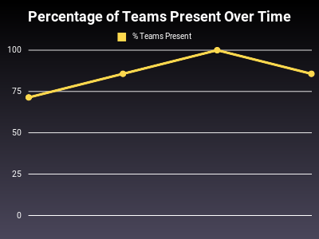

# Chef Slack Meeting tracking
This document tracks status updates from Progress teams. While other
teams such as Sous Chefs, Cinc, and Meta sometimes post updates, this
document tracks internal teams only

This page is generated by slack_meeting_stats.rb, do not edit manually

## Trends

## 2025-03-27

| Team | Present | Current work | Build Status | If builds broken, points to work to fix it | Extra |
| --- | ---- | --- | --- | --- | --- |
| Automate | :white_check_mark: | :white_check_mark: | :x: | ➖ | - |
| Chef Client | :white_check_mark: | :white_check_mark: | main: :red_circle:, 18: :white_check_mark: | ➖ | listed merged PRs |
| Chef Server | :white_check_mark: | :white_check_mark: | main: :red_circle: | ➖ | - |
| Chef Workstation | :white_check_mark: | :white_check_mark: | :x: | ➖ | listed merged PRs |
| Courier | :white_check_mark: | :white_check_mark: | :x: | ➖ | - |
| Habitat | :white_check_mark: | :white_check_mark: | main: :white_check_mark: | ➖ | - |
| Inspec | :white_check_mark: | :white_check_mark: | :x: | ➖ | listed merged PRs |

## 2025-03-20

| Team | Present | Current work | Build Status | If builds broken, points to work to fix it | Extra |
| --- | ---- | --- | --- | --- | --- |
| Automate | :white_check_mark: | :white_check_mark: | :x: | ➖ | - |
| Chef Client | :white_check_mark: | :white_check_mark: | :x: | ➖ | - |
| Chef Server | :white_check_mark: | :white_check_mark: | :x: | ➖ | - |
| Chef Workstation | :white_check_mark: | :white_check_mark: | :x: | ➖ | - |
| Courier | :white_check_mark: | :white_check_mark: | :x: | ➖ | - |
| Habitat | :white_check_mark: | :white_check_mark: | main: :white_check_mark: | ➖ | - |
| Inspec | :white_check_mark: | :white_check_mark: | :x: | ➖ | listed merged PRs |

## 2025-03-13

| Team | Present | Current work | Build Status | If builds broken, points to work to fix it | Extra |
| --- | ---- | --- | --- | --- | --- |
| Automate | :white_check_mark: | :white_check_mark: | :x: | ➖ | - |
| Chef Client | :white_check_mark: | :white_check_mark: | main: :red_circle:, 18: :red_circle: | ➖ | listed merged PRs |
| Chef Server | :white_check_mark: | :white_check_mark: | :x: | ➖ | - |
| Chef Workstation | :white_check_mark: | :white_check_mark: | :x: | ➖ | - |
| Courier | :white_check_mark: | :white_check_mark: | :x: | ➖ | - |
| Habitat | :white_check_mark: | :white_check_mark: | main: :white_check_mark: | ➖ | - |
| Inspec | :white_check_mark: | :white_check_mark: | :x: | ➖ | - |

## 2025-03-06

| Team | Present | Current work | Build Status | If builds broken, points to work to fix it | Extra |
| --- | ---- | --- | --- | --- | --- |
| Automate | :x: | :x: | :x: | ➖ | - |
| Chef Client | :white_check_mark: | :white_check_mark: | main: :white_check_mark:, 18: :red_circle: | ➖ | listed merged PRs |
| Chef Server | :white_check_mark: | :white_check_mark: | :x: | ➖ | - |
| Chef Workstation | :white_check_mark: | :white_check_mark: | :x: | ➖ | - |
| Courier | :white_check_mark: | :white_check_mark: | :x: | ➖ | - |
| Habitat | :white_check_mark: | :white_check_mark: | main: :white_check_mark: | ➖ | - |
| Inspec | :white_check_mark: | :white_check_mark: | :x: | ➖ | - |

## 2025-02-27

| Team | Present | Current work | Build Status | If builds broken, points to work to fix it | Extra |
| --- | ---- | --- | --- | --- | --- |
| Automate | :white_check_mark: | :white_check_mark: | :x: | ➖ | - |
| Chef Client | :white_check_mark: | :white_check_mark: | main: :red_circle:, 18: :red_circle: | ➖ | listed merged PRs |
| Chef Server | :white_check_mark: | :white_check_mark: | :x: | ➖ | - |
| Chef Workstation | :x: | :x: | :x: | ➖ | - |
| Courier | :white_check_mark: | :white_check_mark: | :x: | ➖ | - |
| Habitat | :white_check_mark: | :white_check_mark: | main: :white_check_mark: | ➖ | - |
| Inspec | :x: | :x: | :x: | ➖ | - |
